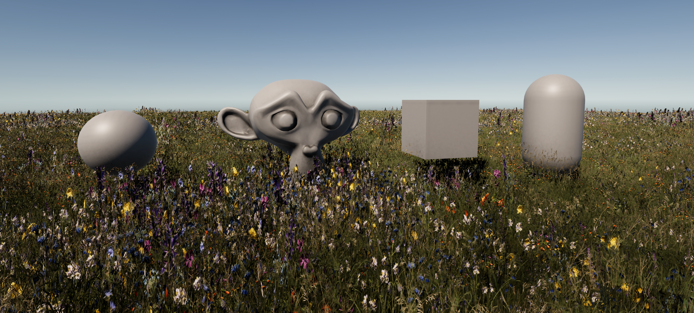
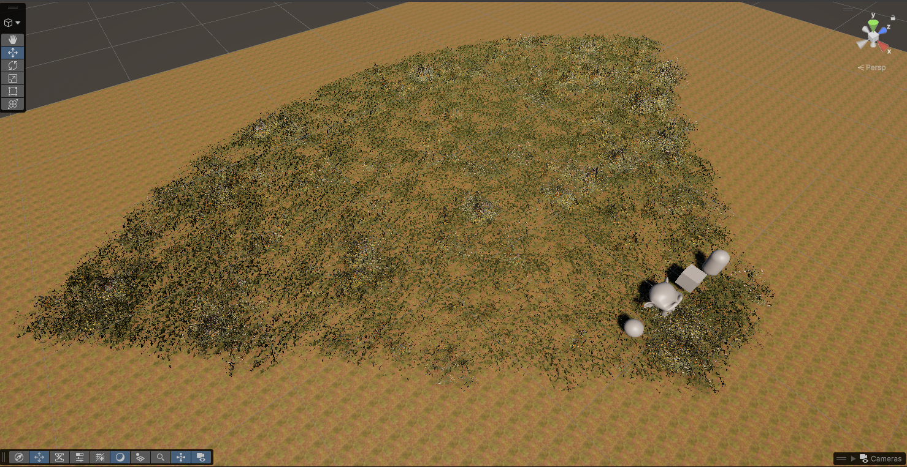
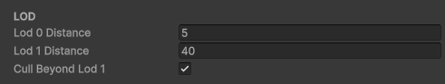
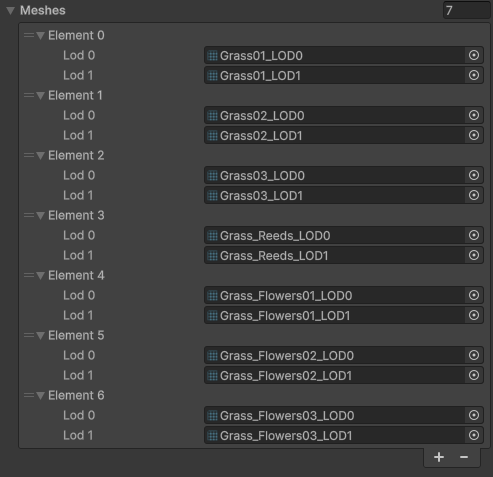
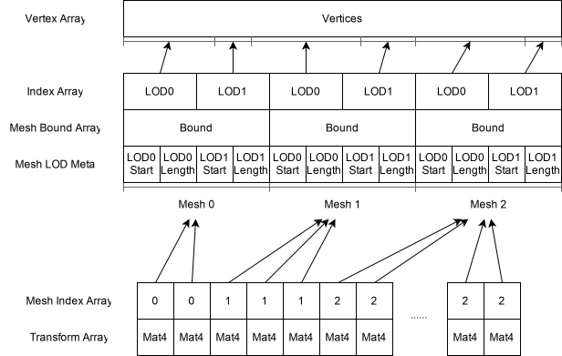
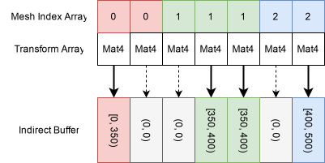
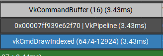
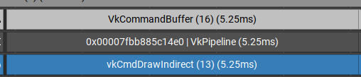

# Unity GPU Indirect Rendering

Demo Unity project to render grass with GPU driven frustum culling, LOD selection and indirect draw. Made with Unity 6000.6.0f1, targeting Vulkan backend.

## Feature

- Supports any number of instances
- Configurable LOD selection distance
  
- Supports any number of meshes, with 2 LOD slots per mesh available
  

## Implementation

The indirect draw system is composed of 3 stages.

### Preparation

- The render feature aggregates mesh data into contiguous arrays, including vertex array, index array, mesh LOD meta array, mesh bound array
- The instance generator randomly place grass and clusters of flower, and store as matrix array and index array

### Drawcall Generation

Given the above arrays, a compute kernel is invoked, where each thread corresponds to an element in mesh index array or transform array. The kernel:

1. Calculates distance from camera to bound center
2. Decides LOD level to draw with the distance
3. Check if the bound is outside the frustum, cull if positive

During above process, the kernel generates an indirect buffer of the exact length as matrix array and index array. The culled instances are stored as empty drawcalls (index count 0) in the indirect buffer.

### Rendering

The rendering takes a material (shared across all instances!), then invokes indirect draw with the indirect buffer. The material is a fork of URP Lit shader, where the vertex shader fetches the object matrix from transform array instead of `_UnityObjectToWorld`

## Benchmark

### Environment

- **GPU**: NVidia RTX 4060 Laptop
- **Resolution**: 2560x1440 (2K)
- **OS**: Debian GNU/Linux testing
- IL2CPP, Development build (for multi-frame profiling)

### Result

| Config            | Overall (ms)    | Gbuffer Pass (ms) |
| ----------------- | --------------- | ----------------- |
| CPU               | 106.63 +/- 4.26 | - [^1]            |
| CPU+LOD           | 105.27 +/- 3.58 | - [^1]            |
| CPU+Cull          | 37.70 +/- 3.38  | 5.15              |
| CPU+LOD+Cull      | 19.84 +/- 2.5   | 3.43              |
| Indirect          | 11.75 +/ 0.15   | 6.41              |
| Indirect+LOD      | 10.21 +/- 0.30  | 5.40              |
| Indirect+Cull     | 11.28 +/- 0.12  | 5.70              |
| Indirect+LOD+Cull | 9.81 +/- 0.11   | 5.25              |

[^1]: Nvidia Nsight Graphics failed to collect data due to event buffer overflow, caused by extremely long frametime

### Analysis

Comparing between different setups in indirect rendering, it's easy to spot that LOD+Cull > LOD > Cull > None.

- LOD helps reduce on-screen tri count, reducing rasterizer workload and overhead
- Culling helps reduce invocations of vertex shaders, by reducing the actual drawcalls to process. However, for the current scenario, where tri count for each instance is small and each triangle covers a lot of pixels, this reduction isn't significant.

Comparing the actual pass time between traditional and indirect rendering, traditional rendering actuall spend less time in the pass! The exact reason is still unknown, one possible reason is that Vulkan drivers are more optimized for large number of individual drawcalls.

| Traditional                | Indirect                        |
| -------------------------- | ------------------------------- |
|  |  |

Despite this, in terms of overall frametime, indirect rendering still has massive advantage over traditional method, where CPU culls and records each instance as a drawcall. This suggests that we are running into CPU bound issue on traditional rendering -- which sounds like what will happen when we try to cull over 40000 objects per frame. It is estimated that CPU spent >10ms on culling. Meanwhile, it only takes GPU 0.08ms to do the same job.
